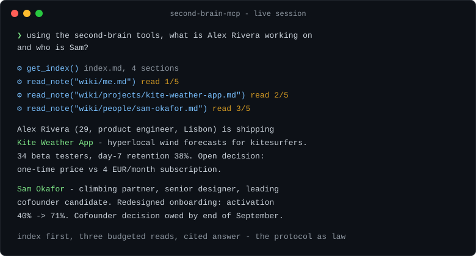
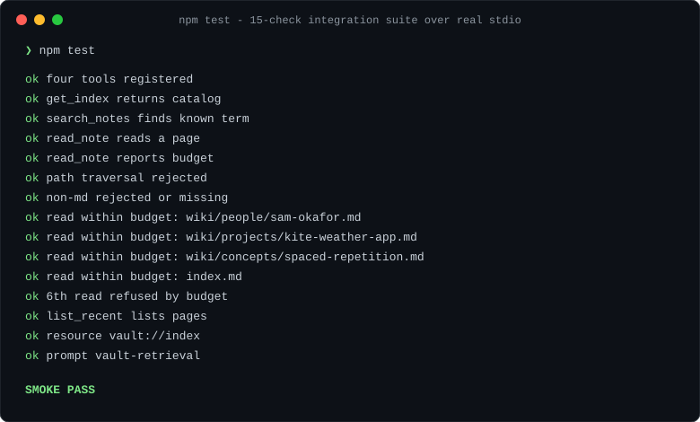

# second-brain-mcp

[](https://github.com/nanthansr/second-brain-mcp/actions/workflows/ci.yml)
[](LICENSE)
[](package.json)

A read-only [MCP](https://modelcontextprotocol.io) server for any Obsidian or plain-markdown vault, with the retrieval protocol **enforced by the server** instead of requested in prose.

Point it at a folder of markdown notes and every MCP client - Claude Code, Claude Desktop, Cursor, anything - can query that knowledge base through four governed tools. The server physically cannot write, cannot leave the vault directory, and cuts a session off after a hard budget of page reads.



## Why

Personal knowledge bases end up welded to one tool. The notes live in Obsidian; the AI assistant that could use them lives somewhere else, so you copy-paste. And when an assistant does get file access, "please read only what you need" is a politeness request, not a rule.

This server fixes both:

- **One connector, every app.** MCP is the USB-C of AI tools - write the vault connector once and any MCP client can use it.
- **The protocol is law, not a suggestion.** Index-first retrieval, a hard page-read budget, read-only access, and a path sandbox are enforced in code. The only operations that exist are the governed ones.

## Install

Requires [Node.js](https://nodejs.org) 18 or newer.

### Option A - from npm

```bash
claude mcp add second-brain -- npx -y second-brain-mcp /abs/path/to/your/vault
```

That single command registers the server with Claude Code; `npx` fetches and runs the package automatically. For other clients, see the config blocks below.

### Option B - from source

```bash
git clone https://github.com/nanthansr/second-brain-mcp
cd second-brain-mcp
npm install && npm run build
npm test   # 15-check integration suite - should end with SMOKE PASS
claude mcp add second-brain -- node /abs/path/to/second-brain-mcp/dist/index.js /abs/path/to/your/vault
```

### Claude Desktop

Add to `claude_desktop_config.json` (Settings → Developer → Edit Config):

```json
{
  "mcpServers": {
    "second-brain": {
      "command": "npx",
      "args": ["-y", "second-brain-mcp", "/abs/path/to/your/vault"]
    }
  }
}
```

### Cursor

Add the same block to `~/.cursor/mcp.json` (or Cursor Settings → MCP → Add new server).

### No vault handy?

Omit the vault argument entirely and the server serves its bundled fictional demo vault ("Alex Rivera") - useful for trying it in 30 seconds:

```bash
claude mcp add second-brain-demo -- npx -y second-brain-mcp
```

## Pointing it at your Obsidian vault

Your vault is just a folder - the one you picked when Obsidian said "Open folder as vault". Pass that folder's absolute path as the argument:

| OS | Example |
|---|---|
| Windows | `C:/Users/you/Documents/my-vault` |
| macOS / Linux | `/Users/you/Documents/my-vault` |

Notes:

- An **`index.md` at the vault root** unlocks the index-first flow (`get_index`): a catalog page with one line per note. If you don't have one, everything still works - the model falls back to `search_notes`.
- Obsidian's own config (`.obsidian/`) and any other dotfolders are invisible to the server.
- The server never modifies anything - Obsidian can stay open while it runs.

## Usage

Once connected, just ask questions. Typical flows (from a real session against the demo vault):

> **"What is Alex Rivera working on and who is Sam?"**
> → `get_index` → `read_note` ×3 (each stamped `read 1/5`, `read 2/5`, `read 3/5`) → cited answer.

> **"What changed in my vault this week?"**
> → `list_recent(days: 7)` → dated list, newest first.

> **"Where do I keep my notes about pricing?"**
> → `search_notes(query: "pricing")` → matching pages with line-numbered snippets, no budget spent.

Clients that support MCP prompts also get `vault-retrieval` - a slash-command template that pins the model to the index-first protocol for a given question.

## What the client gets

| Kind | Name | What it does | Budget |
|---|---|---|---|
| tool | `get_index` | Returns `index.md`, the one-line-per-page catalog. Call first. | free |
| tool | `search_notes` | Case-insensitive search, returns pages + line-numbered snippets | free |
| tool | `read_note` | Full content of one page by vault-relative path | counted |
| tool | `list_recent` | Pages modified in the last N days, newest first | free |
| resource | `vault://index` | The index as an MCP resource | free |
| prompt | `vault-retrieval` | The index-first protocol as a reusable prompt template | - |

The intended flow mirrors how a careful human uses a wiki: read the catalog, open the one or two pages that matter, answer with citations. Locating is cheap; reading is budgeted.

## Configuration

| Setting | How | Default |
|---|---|---|
| Vault path | first CLI argument, or `VAULT_PATH` env | bundled `sample-vault/` |
| Page read budget | `VAULT_READ_BUDGET` env | 5 per session |

## Security model

- **Read-only by construction.** No write, edit, or delete tool exists in the codebase.
- **Path sandbox.** Every path is canonicalized with `path.resolve` first, then checked against the vault root - traversal attempts (`../…`) are rejected. Only `.md` files are readable.
- **Hard page budget.** After N `read_note` calls (default 5) the server refuses further reads and tells the model to synthesize from what it has. Failed reads do not consume budget.
- **Size caps.** Notes truncate at 50KB; search results and recency lists are capped.
- **Dotfolders skipped.** `.obsidian`, `.git`, and other dotfolders are invisible.
- **Code is public, data is not.** The repo contains only server code and a fictional demo vault. Your real vault is whatever folder you mount at runtime; it never leaves your machine.

## FAQ

**Does my data leave my machine?**
No. The server runs locally as a child process of your MCP client and reads files from disk. There is no network code in it.

**Can it modify or delete my notes?**
No. There is no tool that writes. This is a property of the code, not a setting.

**What happens when the model hits the budget?**
The 6th read returns an error telling the model to synthesize from the pages it already has. A new conversation gets a fresh budget.

**Why did the demo answer talk about "Alex Rivera"?**
You're on the bundled fictional demo vault. Pass your own vault path as the first argument.

## Development

```bash
npm run build   # tsc -> dist/
npm test        # build + 15-check smoke test (spawns the real server over stdio)
```



The smoke test uses the SDK's own client against the compiled server - real protocol, no mocks. It verifies all four tools, the resource, the prompt, path-traversal rejection, and that the read budget refuses the N+1th read. CI runs it on Linux and Windows, Node 20 and 22.

Curious why it's built this way? See [docs/design-notes.md](docs/design-notes.md) - transports, the three MCP primitives, schemas-as-prompts, and the sandbox and budget decisions.

## Roadmap

- Remote variant (streamable HTTP) so the vault is reachable from hosted clients, with auth
- Optional per-folder scoping (serve only `wiki/`, hide `journal/`)

## Contributing

Issues and PRs welcome. Keep the invariants: no write tools, no network calls, the smoke test stays green and unweakened.

## License

[MIT](LICENSE) · Changes in [CHANGELOG.md](CHANGELOG.md)
